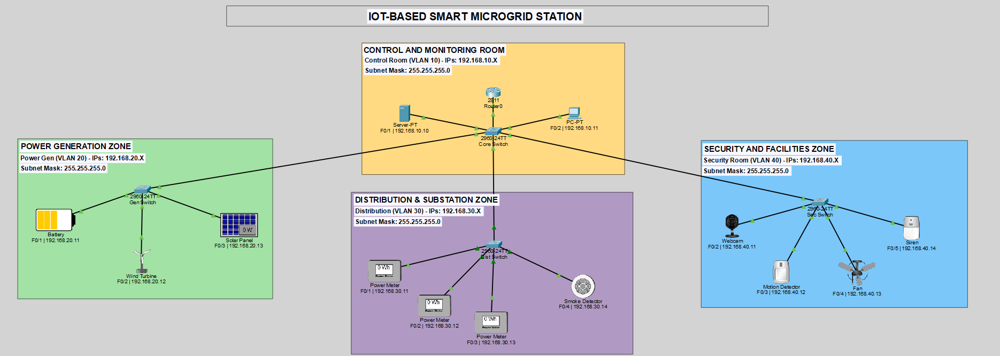
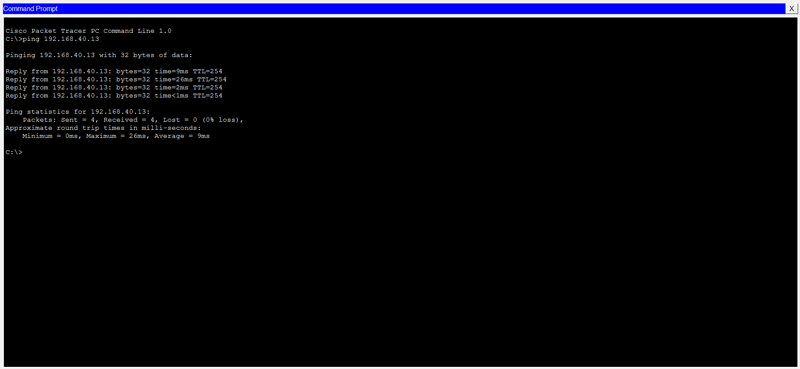
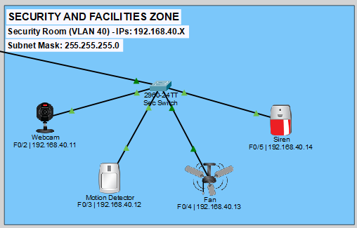

# IoT-Based Smart Green Energy Microgrid Station

A secure and automated **Smart Microgrid Station** designed in **Cisco Packet Tracer**. 

This project demonstrates how to segment critical power infrastructure using **VLANs**, route traffic securely via **Router-on-a-Stick** and deploy real-time **IoT automation loops** for grid safety and monitoring.

---

## 📌 Project Overview

Modern green energy grid stations rely heavily on connected automation. However, merging administrative control terminals, physical power generators and safety alarms onto a single, flat network introduces severe security risks. If a single outdoor webcam or sensor is physically compromised or glitched, an attacker could gain direct access to the entire grid's operational system.

This project solves this vulnerability by implementing a structured, segmented network architecture divided into four distinct **Virtual Local Area Networks (VLANs)**. A centralized IoT registration server aggregates live telemetry and evaluates event-driven safety logic to protect the grid.

### Key Highlights:
* **Network Segmentation (Layer 2):** Prevents broad network chatter (broadcast storms) and blocks unauthorized lateral movement by isolating administrative, generation and physical security devices.
* **Router-on-a-Stick Routing (Layer 3):** Uses virtual sub-interfaces configured on a single physical router link to route traffic securely between VLANs without wasting expensive router ports.
* **Centralized Telemetry Monitoring:** Aggregates real-time power data from digital meters, wind turbines, and solar panels to a dedicated central monitoring portal.
* **Automated Safety Overrides:** Evaluates real-time sensor triggers (e.g., smoke or motion detection) to instantly sound sirens or spin ventilation exhaust fans across network boundaries.

---

## 🏗️ Network Topology

Our design uses a **Star Network Topology** centered around a core switch backbone connecting the specialized zones.



---

## 📋 IP Addressing & Subnet Division Schema

The network utilizes Class C IPv4 space. To keep configuration intuitive and ease future troubleshooting, we mapped the **third octet** of each subnet directly to its respective **VLAN ID**:

| Department / Zone | VLAN ID | Subnet Address | Default Gateway | Core Hardware & Nodes Included |
| :--- | :---: | :--- | :--- | :--- |
| **Control & Monitoring** | `10` | `192.168.10.0/24` | `192.168.10.1` | `Admin_PC` (10.11), `Server0` (10.10) |
| **Power Generation** | `20` | `192.168.20.0/24` | `192.168.20.1` | Battery (20.11), Wind Turbine (20.12), Solar Panel (20.13) |
| **Distribution Substation** | `30` | `192.168.30.0/24` | `192.168.30.1` | 3x Power Meters (30.11-30.13), Smoke Detector (30.14) |
| **Security & Facilities** | `40` | `192.168.40.0/24` | `192.168.40.1` | IP Webcam (40.11), Motion Detector (40.12), Ceiling Fan (40.13), Siren (40.14) |

### 🔒 Note on Address Allocations
* **Network ID (`.0`):** Reserved for subnet boundary identification.
* **Default Gateways (`.1`):** Assigned to the router's virtual sub-interfaces to serve as the exit door for inter-subnet communication.
* **Broadcast Address (`.255`):** Reserved for internal network-wide paging within each subnet.
* **Static IP Mapping:** All critical grid nodes utilize static IP configurations rather than dynamic DHCP to ensure absolute address permanence, preventing critical automation loops from breaking due to lease changes.

---

## 🛠️ Configuration Highlights

### 1. Router-on-a-Stick Sub-Interface Layout
The single physical link `GigabitEthernet 0/0` on the core router is split into virtual channels. Each sub-interface is bound to its specific VLAN using 802.1Q encapsulation:

```text
Router# configure terminal
Router(config)# interface GigabitEthernet 0/0.10
Router(config-subif)# encapsulation dot1Q 10
Router(config-subif)# ip address 192.168.10.1 255.255.255.0
Router(config-subif)# exit

Router(config)# interface GigabitEthernet 0/0.20
Router(config-subif)# encapsulation dot1Q 20
Router(config-subif)# ip address 192.168.20.1 255.255.255.0
Router(config-subif)# exit

```

## 🧪 Simulation Testing & Verification

### Test 1: Inter-VLAN Routing Verification
To prove our sub-interfaces are correctly routing traffic across network layers, we verify connectivity with an ICMP ping from the Control Room to the Security Zone. 

Below is the verified screenshot of our successful ping test from the Admin PC to the Ceiling Fan:



```text
Admin_PC> ping 192.168.40.13

Pinging 192.168.40.13 with 32 bytes of data:
Reply from 192.168.40.13: bytes=32 time<1ms TTL=254
Reply from 192.168.40.13: bytes=32 time<1ms TTL=254
Ping statistics for 192.168.40.13:
    Packets: Sent = 4, Received = 4, Lost = 0 (0% loss)
```
### Test 2: IoT Automation Logic
Devices on VLAN 20, 30, and 40 establish client-server sockets back to the IoT Server (`192.168.10.10`). Because live environment physics can occasionally lag in simulation, we test system responsiveness by toggling device states directly through the central server's web portal.

Below is the verified screenshot of our IoT server logic and active conditions setup:



* Triggering a simulated environmental sensor event successfully initiates cross-subnet automation commands—instantly sounding the emergency **Siren** (VLAN 40) and switching the **Ceiling Fan** (VLAN 40) to high-speed ventilation.
